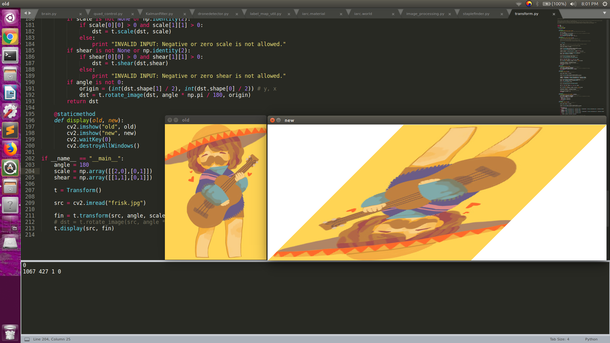

# FeatureDetector
### CompRobo 2018

##### Repo of deliverables for the final project.
##### Contains classes for proof of concept linear transforms (scale, skew, rotate).

This repo contains classes to manipulate an image by using Numpy matrix multiplication to perform linear transforms.
The rotational code is taken from Alex & Gareth Rees' [StackOverflow answer here](https://codereview.stackexchange.com/questions/41688/rotating-greyscale-images), while the scaling and skew functions are homebrew.

*All three available transforms.*
